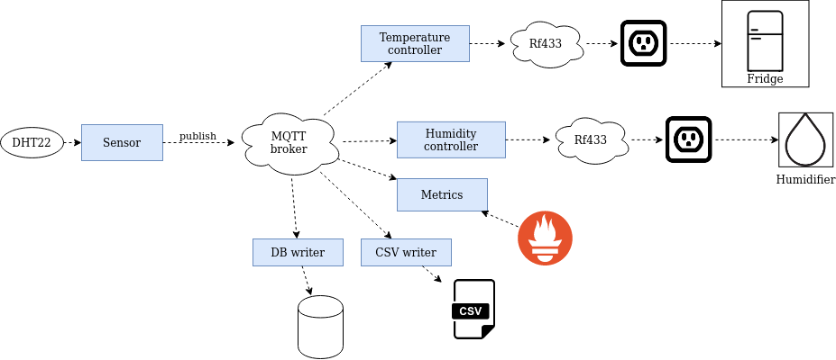

# Meat curing chamber

Raspberry Pi meat curing chamber and mini IoT framework

See [documentation](./doc/design.md) for more info.

## Packages

* csv_writer (Python) - Writes humidity and temperature data to CSV file
* dht (Python) - Publishes humidity and temperature data from Adafruit DHT series sensors
* metrics (Python) - Exposes metrics with Prometheus
* monitor_flutter (Dart/Flutter) - Flutter (tested with Android) app that displays humidity and temperature
* monitor-web (JS) - Web app that displays humidity and temperature
* rf433-cpp (C++) - Operates 433hz devices, used to turn on/off humidifier and fridge
* rf433-py (Python) - Operates 433hz devices, used to turn on/off humidifier and fridge
* slack (Python) - Posts messages to slack channel

## Build

### Clone repo

    git clone https://github.com/mattcontinisio/meat-curing-chamber.git

### Python

Python packages can be built individually.

    cd packages/dht/
    pip3 install .

### C++

#### Install dependencies

See `scripts/install_*` scripts for how to install dependencies.

#### Build with CMake

    mkdir build
    cd build
    cmake ..
    make

There is also a build script for convenience.

    # Creates _build_release_gcc_make folder
    ./scripts/build_cpp.sh release gcc make

### monitor_flutter

monitor_flutter is a [Flutter](https://flutter.dev/) app that displays the current humidity and temperature data.

    cd packages/monitor_flutter

    # Run app
    flutter run

### monitor-web

monitor-web is a [React](https://reactjs.org/) web app that displays the current humidity and temperature data.

    cd packages/monitor-web

    # Run app in development mode
    yarn start

    # Build app for produciton
    yarn build

See the [Readme](./packages/monitor-web/README.md) for more info.

### Bazel

work in progress

## Usage

* Run MQTT message broker such as [Mosquitto](https://mosquitto.org/)
* Set up Raspberry Pi hardware
* Configure and run services

### Basic humidifier controller

Create configuration. See `config/bedroom.ini` for example.

Run DHT service

    # Use config.ini
    ./packages/dht/scripts/dht.sh

    # Specify config file to use
    ./packages/dht/scripts/dht.sh -c config/bedroom.ini

Run humidity controller

    # Use config.ini
    ./packages/rf433-cpp/scripts/humidity_controller.sh

    # Specifiy config file to use
    ./packages/rf433-cpp/scripts/humidity_controller.sh -c config/bedroom.ini

Other services can optionally be run for monitoring, logging, etc.

### Meat curing chamber

Create configuration. See `config/fridge.ini` for example.

Run DHT service

    ./packages/dht/scripts/dht.sh -c config/fridge.ini

Run humidity controller

    ./packages/rf433-cpp/scripts/humidity_controller.sh -c config/fridge.ini

Run temperature controller

    ./packages/rf433-cpp/scripts/temperature_controller.sh -c config/fridge.ini

Other services can optionally be run for monitoring, logging, etc.
