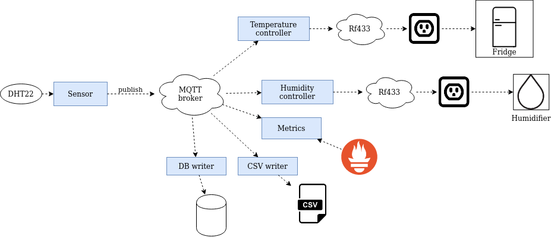

# Meat curing chamber design

## Hardware

* The fridge is plugged into a [remote control outlet](https://www.etekcity.com/product/100068), which a RF433Mhz transmitter can turn on and off.
* A humidifier is plugged into a remote control outlet and sits inside the fridge.
* A [DHT22 sensor](https://www.adafruit.com/product/385) is connected to the Raspberry Pi and sits inside the fridge to read humidity and temperature data.
* An [RF433Mhz transmitter](https://www.electrodragon.com/product/433m-rf-wireless-transmitter-module/) is connected to the Raspberry Pi which can turn the remote control outlets on and off.

## Software

The meat curing chamber is made up of different services and an MQTT message broker. Currently, only two topics are used:
  * `{location}/humidity`
  * `{location}/temperature`

where `{location}` represents where the sensor is, such as `home/bedroom`. Services can either publish or subscribe to these topics. In the future, this topic structure can be expanded, but for simple applications like controlling/monitoring temperature and humidity, this topic structure is a good start.

Services can also be configured to run for other purposes other than a meat curing chamber. For example, you can run `dht` and `humidity_controller` without a `temperature_controller` if you just want to control a humidifier.

### Services

* dht - The `dht` service reads humidity and temperature data from a [DHT22 sensor](https://www.adafruit.com/product/385) and publishes the data to the topics:
    * `{location}/humidity`
    * `{location}/temperature`

  `{location}` is configurable. For example, `fridge.ini` sets it to `home/kitchen/fridge`.

* humidity_controller - The `humidity_controller` service subscribes to the `{location}/humidity` topic and turns a humidifier on/off based on a configurable humidity range. It uses an [RF433Mhz transmitter](https://www.electrodragon.com/product/433m-rf-wireless-transmitter-module/) to do this.  The humidifer is plugged into a [remote control outlet](https://www.etekcity.com/product/100068), which the RF433Mhz transmitter can turn on and off. There is a python and C++ version.

* temperature_controller - The `temperature_controller` service does the same thing as the `humidity_controller` but uses the `{location}/temperature` topic instead and controls a remote control outlet that the fridge is plugged into. There is a python and C++ version.

### Other services

* csv_writer
* metrics
* slack

### Monitoring

Monitoring is a work in progress. The following packages are simple examples that show different approaches to monitoring.

* metrics - The `metrics` service shows how [Prometheus](https://prometheus.io/) can be used for monitoring. The service uses the [Prometheus python client](https://github.com/prometheus/client_python) to expose gauges for humidity and temperature.

* monitor-web - The `monitor-web` package is a [React](https://reactjs.org/) web app that displays the current humidity and temperature for each location. This also shows how [MQTT.js](https://github.com/mqttjs/MQTT.js) can be used in the browser.
